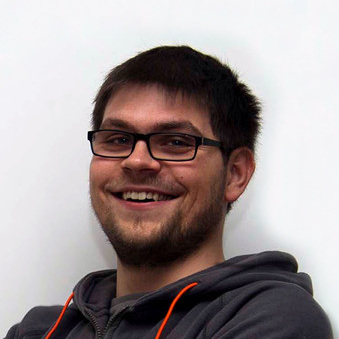

Gerald Pape

  <!-- <a class="navlink" href="#projects">Projects</a> -->
  <a class="navlink" href="#work">Work</a>
  <a class="navlink" href="#education">Education</a>

Hi, my name is Gerald and I am a software developer from Münster. On the internet, I usually go by <em>ubergesundheit</em>. For fun and recreation, I like to try out new programming languages and technologies, tinker with programmable gadgets and embedded systems, cook and eat tasty recipies and read or watch science-fiction. In <a href="http://codeformuenster.org/" target="_blank">Münsters Code for Germany</a> division I voluntarily create civic tech with open data. I'm really interested in technologies and topics like Linux, containers, container orchestration with Kubernetes, decentralization and self-hosting. My secret weakness is owning and trying out mechanical keyboards.
 You can find me on <a href="https://github.com/ubergesundheit" target="_blank" class="icon-github">GitHub</a>, <a href="https://twitter.com/ubergesundheit" target="_blank" class="icon-twitter">Twitter</a> and <a href="https://keybase.io/geraldpape" target="_blank" class="icon-key">Keybase</a>. You can also write me an <a data-href="oi.epapdlareg@liam:otliam" class="obfusmail icon-envelope" rel="nofollow">email</a>.

## Work
<dl>
  <dt>May 2018 &ndash; Now</dt>
  <dd>Full Stack software engineer at <a href="https://www.foodtracks.de/" target="_blank">FoodTracks</a>. Development and maintenance of customer facing software for order optimization &amp; business data analysis. Maintenance and deployment of infrastructure and CI/CD.
  
Technologies: React, Python, Docker, Node.js, Ruby on Rails, Go, Ansible, Terraform, GitLab

  </dd>

  <dt>June 2016 &ndash; April 2018</dt>
  <dd>Full stack developer in the <a href="https://sensebox.de/" target="_blank">senseBox</a> project at <a href="http://www.uni-muenster.de/Geoinformatics/en/" target="_blank">Institute for Geoinformatics</a>: Development and maintenance of <a href="https://opensensemap.org/" target="_blank">openSenseMap</a>, an open source citizen science open data platform. 
Technologies: Node.js, MongoDB, Docker, AWS, Ansible, Terraform, Arduino

  </dd>

  <dt>April 2014 &ndash; May 2016</dt>
  <dd>Software Engineer at <a href="https://www.conterra.de/" target="_blank">con terra GmbH</a>: Development of a winter service management platform frontend and a data portal frontend for environmental data. 
Technologies: con terra map.apps, ArcGIS API for JavaScript, ArcGIS Server

  </dd>

  <dt>October 2013 &ndash; Februray 2014</dt>
  <dd>Intern at <a href="https://www.zweitag.de/en/" target="_blank">Zweitag GmbH</a>: Development of a backend for a document orgaization software. 
Technologies: Ruby on Rails, Elasticsearch

  </dd>

  <dt>June 2011 &ndash; August 2013</dt>
  <dd>Student worker at <a href="http://www.uni-muenster.de/Geoinformatics/en/" target="_blank">Institute for Geoinformatics</a>: Support, administration and maintenance for the institutes IT. Development of internal management tools. 
Technologies: PHP, MySQL

  </dd>
</dl>

## Education
<dl>
  <dt>Master of Science Geoinformatics</dt>
  <dd>Completed at <a href="http://www.uni-muenster.de/Geoinformatics/en/" target="_blank">Institute for Geoinformatics</a>. Thesis: <em>Supporting Public Deliberation Through Spatially Enhanced Dialogs</em>
Technologies: Ruby on Rails, AngularJS, Docker

  </dd>

  <dt>Bachelor of Science Geoinformatics</dt>
  <dd>Completed at <a href="http://www.uni-muenster.de/Geoinformatics/en/" target="_blank">Institute for Geoinformatics</a>. Thesis: <em>Arm gesture interaction with virtual globes: Implementation and evaluation</em>
Technologies: Kinect, NASA World Wind

  </dd>
</dl>

### My other online profiles

<a href="https://www.xing.com/profile/Gerald_Pape3" target="_blank">Xing</a>
<a href="https://www.linkedin.com/in/gerald-pape-93b003103/" target="_blank">LinkedIn</a>
